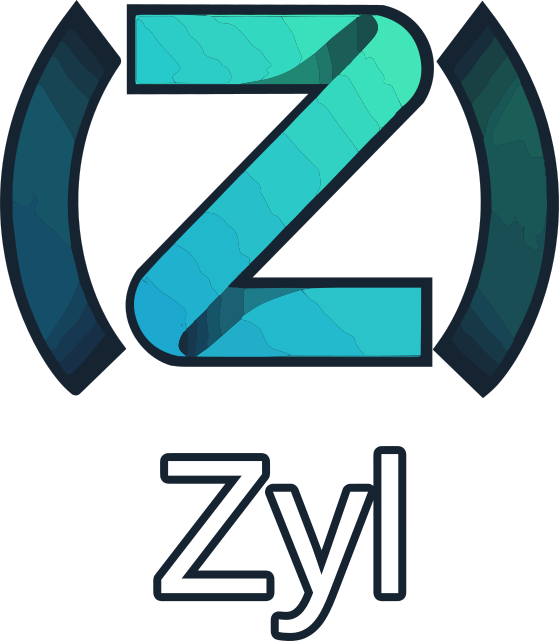

<div align="center">
  </img>
  <p><strong>Deterministic Power. Expressive Safety.</strong></p>
</div>

# Zyl Skill

An agent skill that gives Claude Code (and other skill-aware agents) expert
knowledge of [Zyl](https://github.com/larrydewey/zyl) — the deterministic,
self-hosted Lisp systems language — for writing, reviewing and debugging Zyl
code and the Zyl compiler itself.

Zyl's specification describes much more than the compiler currently
implements, and many of the gaps fail *silently*: the program compiles and
computes the wrong answer. An agent working from the spec, or from general
Lisp knowledge, will write code that looks right and isn't. This skill records
what the compiler **actually does today**, so the agent writes code that works.

> **The spec is the design; the compiler is the truth.** When a rule and the
> spec disagree, follow the rule. When a rule and the compiler disagree, the
> compiler wins — then fix the rule.

## What's Inside

- **173 rules** in 26 categories, grouped into five tiers and prioritized by
  impact (CRITICAL = silent miscompile, wrong result or crash).
- **8 reference tables** for fast lookup: silent-failure pitfalls, error
  codes, built-ins, the standard library, the compiler pipeline,
  spec-vs-implementation status, debugging, and migration from Rust/C/Lisp.
- **The Ten Facts** — the short list of behaviors every Zyl author must
  internalize, at the top of [`SKILL.md`](SKILL.md).

```
.
├── SKILL.md          # entry point: ten facts, category table, index of every rule
├── rules/            # one rule per file: Why It Matters, Bad, Good, Notes, See Also
├── references/       # dense lookup tables
└── assets/           # logo and mascot
```

### Tiers

| Tier | Scope | Categories |
|---|---|---|
| 1 — Foundations | Every line of Zyl | Syntax, functions & control flow, data, pattern matching, errors, contracts |
| 2 — Language Model | Idiomatic programs | Ownership & regions, types, generics, traits, closures, macros |
| 3 — Systems | Low-level work | FFI, actors, bits & buffers, secrets & constant-time, crypto |
| 4 — Engineering | Real projects | Testing, modules & packages, determinism, tooling, project idioms |
| 5 — Compiler Internals | `stdlib/compiler/`, `selfhost/` | Bootstrap & fixed point, ICNF, x86_64 codegen, compiler passes |

The full category table, with rule counts and prefixes, is in
[`SKILL.md`](SKILL.md#rule-categories-by-priority).

### References

| File | Use it when |
|---|---|
| [`pitfalls.md`](references/pitfalls.md) | Reviewing any Zyl code — the silent-failure checklist |
| [`error-codes.md`](references/error-codes.md) | The compiler reported an `E_*` code |
| [`debugging.md`](references/debugging.md) | Behavior is wrong but nothing reported an error |
| [`builtins.md`](references/builtins.md) | Checking whether a built-in exists and how it behaves |
| [`stdlib.md`](references/stdlib.md) | Looking for a library function (never invent one) |
| [`implementation-status.md`](references/implementation-status.md) | Checking whether a spec feature is actually implemented |
| [`pipeline.md`](references/pipeline.md) | Working on the compiler's passes |
| [`migration.md`](references/migration.md) | Coming from Rust, C or another Lisp |

## Installation

The skill is a directory named `zyl` containing `SKILL.md`. Put it where your
agent looks for skills.

**Claude Code, for all projects:**

```bash
git clone https://github.com/larrydewey/zyl-skill.git ~/.claude/skills/zyl
```

**Claude Code, for one project** (for example, inside a Zyl checkout):

```bash
git clone https://github.com/larrydewey/zyl-skill.git .claude/skills/zyl
```

The skill activates automatically when the agent touches `*.zyl` files,
`zyl.pkg` / `zyl.lock` manifests, the `selfhost/` tree or `stdlib/compiler/`,
or when you ask about Zyl. You can also invoke it directly with `/zyl`.

## How the Agent Uses It

| Task | Where it starts |
|---|---|
| Writing new code | Tier 1 plus the categories the task touches; every **[CRITICAL]** rule |
| Reviewing code | [`references/pitfalls.md`](references/pitfalls.md), top to bottom |
| Hitting an error | [`references/error-codes.md`](references/error-codes.md) |
| Odd behavior, no error | [`references/debugging.md`](references/debugging.md) |
| Unsure a feature exists | [`implementation-status.md`](references/implementation-status.md), [`builtins.md`](references/builtins.md), [`stdlib.md`](references/stdlib.md) |
| Changing the compiler | All of Tier 5 plus [`references/pipeline.md`](references/pipeline.md) |

A few examples of what the rules catch:

```lisp
(let ((x 1) (y 2)) (+ x y))        ; not rejected -- compiles to the wrong program
(let x 1 (let y 2 (+ x y)))        ; correct: let binds exactly one name

(defn greet (name) (print name))   ; prints the string's address as an integer
(defn greet ((name String))        ; correct: annotate String/Float params
  (print-string name))

(+ 1.5 2)                          ; Int/Float mix: garbage, no diagnostic
```

## Rule Format

Every file in `rules/` follows the same shape, so the agent (and you) can read
any rule in isolation:

```markdown
# <prefix>-<slug>

> One-line statement of the rule.

## Why It Matters
## Bad
## Good
## Notes
## See Also
```

The one-line `>` statement is what appears in the `SKILL.md` index.

## Keeping It Current

A stale skill produces wrong code with high confidence. When the compiler
changes — a form gets lowered, a check starts firing, a bug is closed:

1. Update the affected rule in `rules/`.
2. Update its row in [`references/implementation-status.md`](references/implementation-status.md)
   and, if it was a silent failure, [`references/pitfalls.md`](references/pitfalls.md).
3. Regenerate the rule index in `SKILL.md` from the rules' `>` lines.

Sources, in order of authority: the compiler source (`stdlib/compiler/`,
`selfhost/`, `runtime/`), then `PROGRESS.md` and `docs/`, then the book
(`book/src/`) and `zyl_specification.txt`.

---

<div align="center">
  </img>
  <p><em>Hygienic, Homoiconic, Hardened</em></p>
</div>
